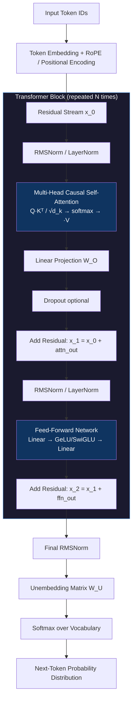

# Transformer Architecture: In-Depth Technical Breakdown

---

## Self-Attention

Self-attention is the core computational primitive of the Transformer. Given a sequence of input tokens, it allows every position to directly attend to every other position in a single pass — no recurrence, no convolution.

### Query, Key, Value (Q, K, V)

For each token embedding **x** of dimension `d_model`, three separate linear projections produce:

```
Q = x · W_Q     (what am I looking for?)
K = x · W_K     (what do I advertise about myself?)
V = x · W_V     (what do I contribute if chosen?)
```

All three weight matrices `W_Q`, `W_K`, `W_V` ∈ ℝ^(d_model × d_k) are learned.

### Scaled Dot-Product Math

The attention output for a full sequence is computed as:

```
Attention(Q, K, V) = softmax( Q · Kᵀ / √d_k ) · V
```

Step by step:

1. **Similarity scores**: `Q · Kᵀ` produces an (seq_len × seq_len) matrix. Entry `[i, j]` scores how relevant token `j` is to token `i`.
2. **Scaling by √d_k**: Raw dot products grow in magnitude with `d_k`. Without scaling, the softmax saturates into near-zero gradients. Dividing by `√d_k` keeps variance ≈ 1.
3. **Softmax**: Converts each row into a probability distribution over all positions.
4. **Weighted sum of V**: Each output vector is a convex combination of value vectors, weighted by the attention probabilities.

### Why Self-Attention Beats RNNs on Parallelization

| Dimension              | RNN / LSTM                    | Self-Attention               |
|------------------------|-------------------------------|------------------------------|
| Dependency path length | O(sequence_length)            | O(1) — direct any-to-any    |
| Parallelism            | Sequential; step t needs t-1  | Fully parallel across tokens |
| Gradient flow          | Vanishing/exploding over long seqs | Short-circuits to any depth |
| Hardware utilization   | Poor (sequential bottleneck)  | Excellent (dense GEMM ops)   |

In an RNN, information from token 1 must pass through every intermediate hidden state to reach token 512. In self-attention, token 1 and token 512 interact directly in a single matrix multiply — this is why a Transformer can be trained on thousands of GPU cores with near-linear scaling efficiency.

---

## Multi-Head Attention

A single attention head computes one type of relationship at one subspace. Multi-head attention runs **h independent attention operations in parallel** and concatenates their outputs:

```
head_i  = Attention(Q · W_Q^i,  K · W_K^i,  V · W_V^i)

MultiHead(Q, K, V) = Concat(head_1, ..., head_h) · W_O
```

Each head projects down to `d_k = d_model / h`, so the total compute cost is comparable to a single full-dimensional head.

### What Different Heads Learn

Empirical probing studies (Voita et al., 2019; Clark et al., 2019) reveal that heads specialize:

- **Syntactic heads**: Track subject-verb agreement, dependency arcs (e.g., "the cat that the dogs chased *was* scared" — linking "cat" to "was").
- **Positional heads**: Attend to immediately adjacent tokens, acting like a local n-gram window.
- **Coreference heads**: Link pronouns back to their antecedents across long spans.
- **Rare-token heads**: Distribute attention broadly when a token is semantically ambiguous.

### Why the Ensemble Approach Is Critical

A single head, constrained to one projection subspace, cannot simultaneously represent:
- long-range semantic dependencies
- local syntactic patterns
- cross-sentence discourse structure

Multiple heads let the model build a **factored representation** of context. The final linear projection `W_O` then learns how to recombine these diverse relationship types into a single unified representation passed to the feed-forward sublayer. Without multi-head attention, a Transformer trained on natural language would require dramatically more depth to recover the same representational capacity.

---

## Current Relevance in 2026

Despite the emergence of sub-quadratic architectures — most notably **Mamba** (structured state-space models, S6) and **RWKV** (linear attention recurrence) — the Transformer remains the dominant architecture in production systems. Several converging reasons explain this:

### 1. Hardware Co-Evolution

Modern accelerators (H100, TPU v5, Gaudi 3) are architected around dense matrix multiplications. The `Q·Kᵀ` and softmax operations in self-attention map directly to tensor cores with near-peak utilization. Mamba's selective scan kernel, by contrast, is memory-bandwidth-bound and requires custom CUDA implementations to approach comparable throughput. The ecosystem of compilers (XLA, TorchInductor) is built and optimized for Transformer compute graphs.

### 2. The Quadratic Cost Myth in Practice

The O(n²) attention cost is only a bottleneck for very long contexts. For sequences up to ~128K tokens — which covers nearly all practical NLP tasks — FlashAttention v3 and ring-attention distribute the computation efficiently. Beyond 128K, hybrid architectures (e.g., Gemini 1.5's mixture of full attention and sliding-window attention) handle long context without abandoning the self-attention mechanism entirely.

### 3. Expressiveness and In-Context Learning

Theoretical work (Akyürek et al., 2022; Von Oswald et al., 2023) shows that Transformer attention can implement gradient descent in its forward pass, which underlies in-context learning (ICL). State-space models lack an analogous capability by default, making them weaker at few-shot prompting without architectural modifications.

### 4. Maturity of the Training Stack

Five years of research on Transformer-specific techniques — rotary positional embeddings (RoPE), grouped-query attention (GQA), key-value cache optimizations, RLHF pipelines, and post-training alignment methods — represent a moat that alternative architectures have not yet overcome. Switching architectures requires rebuilding this entire stack.

### 5. State-Space Hybrids as Validation

The most performant "alternative" models in 2025–2026 (Jamba, Zamba, Griffin) are hybrid architectures that interleave SSM layers *with* Transformer attention layers. This convergence confirms that self-attention is not being replaced — it is being selectively augmented.

---

## Architectural Variations

### Encoder-Only: BERT and its Descendants

```
Input Tokens
     │
     ▼
┌─────────────────────────────┐
│  Token + Position Embeddings│
└─────────────┬───────────────┘
              │
    ┌─────────▼──────────┐
    │  Transformer Block  │  × N layers
    │  ┌───────────────┐  │
    │  │ Multi-Head    │  │
    │  │ Self-Attention│  │  (bidirectional — all tokens
    │  │ (full mask)   │  │   can see all other tokens)
    │  └──────┬────────┘  │
    │  ┌──────▼────────┐  │
    │  │  Add & Norm   │  │
    │  └──────┬────────┘  │
    │  ┌──────▼────────┐  │
    │  │  Feed-Forward │  │
    │  │  (2-layer MLP)│  │
    │  └──────┬────────┘  │
    │  ┌──────▼────────┐  │
    │  │  Add & Norm   │  │
    └──┴──────┬─────────┴──┘
              │
     ┌────────▼────────┐
     │  Contextual     │
     │  Representations│  ← one vector per input token
     └─────────────────┘
              │
     ┌────────▼────────┐
     │  Task Head      │  ← classification, NER, QA, etc.
     └─────────────────┘
```

**Key property**: The self-attention mask is fully open — every token attends to every other token in both directions. This produces deeply bidirectional representations where each token's embedding captures its full context.

**Specific use-case — Legal Contract Clause Classification**:

A law firm needs to classify whether individual clauses in a 200-page contract are "indemnification", "limitation of liability", "IP assignment", or "none." An encoder-only model (e.g., `legal-bert-base`) is fine-tuned with a classification head on top of the `[CLS]` token embedding. Because the entire clause is visible to all tokens simultaneously, the model correctly handles ambiguous phrasing like "shall hold harmless" by attending to surrounding context in both directions — something a left-to-right decoder cannot do without generating output first.

---

### Decoder-Only: GPT Series

```
Input Tokens (prompt + generated so far)
     │
     ▼
┌─────────────────────────────┐
│  Token + Position Embeddings│
└─────────────┬───────────────┘
              │
    ┌─────────▼──────────┐
    │  Transformer Block  │  × N layers
    │  ┌───────────────┐  │
    │  │ Causal Multi- │  │
    │  │ Head Attention│  │  (masked — token i can only
    │  │ (causal mask) │  │   attend to tokens 0..i)
    │  └──────┬────────┘  │
    │  ┌──────▼────────┐  │
    │  │  Add & Norm   │  │
    │  └──────┬────────┘  │
    │  ┌──────▼────────┐  │
    │  │  Feed-Forward │  │
    │  │  (2-layer MLP)│  │
    │  └──────┬────────┘  │
    │  ┌──────▼────────┐  │
    │  │  Add & Norm   │  │
    └──┴──────┬─────────┴──┘
              │
     ┌────────▼────────┐
     │ Final LayerNorm │
     └────────┬────────┘
              │
     ┌────────▼────────┐
     │  Unembedding    │  (W_E transposed, or separate W_U)
     │  + Softmax      │
     └────────┬────────┘
              │
     ┌────────▼────────┐
     │  Next-Token     │
     │  Distribution   │  p(token_{t+1} | token_{0..t})
     └─────────────────┘
```

**Key property**: The causal mask (upper-triangular -∞ before softmax) ensures each position can only attend to itself and prior positions. This is the autoregressive inductive bias — necessary for generation, but means representations are left-context-only.

**Specific use-case — Agentic Code Execution**:

A developer uses a GPT-4-class model as an autonomous coding agent. The model receives a system prompt describing available tools and a user request: "refactor this 500-line Python module to use async/await." The decoder-only model generates a multi-step plan token-by-token, produces `<tool_call>` structured outputs to read files, iteratively generates diffs, and emits `<tool_call>` to apply them. The autoregressive nature is essential here: each new token — whether planning text, JSON tool call, or generated code — is conditioned on everything that came before, including prior tool outputs injected back into the context. The KV-cache means each generation step only computes attention for the new token, not the entire sequence, enabling practical latency at thousands of tokens of context.

---

## Mermaid Diagram: Full Transformer Block (Decoder-Only)



### Key Architectural Notes on the Block

| Component | Modern Default (2024–2026) | Original "Attention Is All You Need" |
|---|---|---|
| Normalization | Pre-norm RMSNorm (before sublayer) | Post-norm LayerNorm (after sublayer) |
| Positional encoding | Rotary (RoPE) or ALiBi — no learned table | Sinusoidal absolute |
| Activation | SwiGLU with gated FF | ReLU |
| Attention variant | Grouped-Query Attention (GQA) | Multi-Head Attention |
| FF dimension ratio | 8/3 × d_model (SwiGLU) or 4× (standard) | 4 × d_model |

Pre-norm placement (applying normalization before each sublayer rather than after) stabilizes training at scale by preventing the residual stream magnitude from growing unboundedly in early layers — this change alone was responsible for enabling reliable training of models beyond 1B parameters without learning rate warmup tricks.
